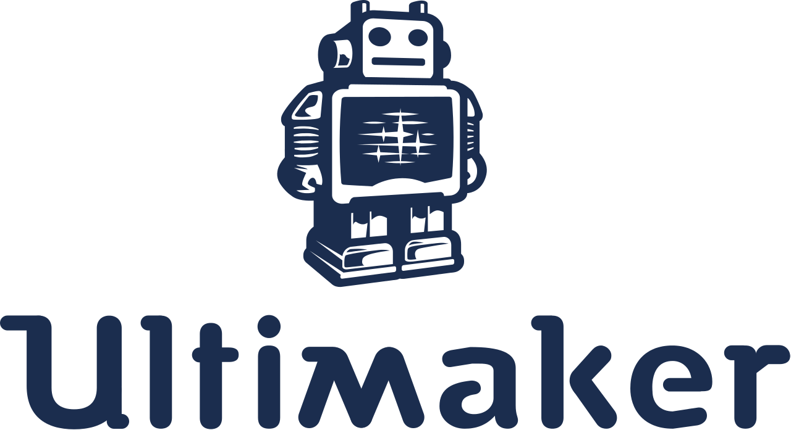

### Day 1:  Introduction to FAB LAB

The course is conducted by the FabLab section of MESCE and was commenced on 2nd August 2017 Wednesday. The course is lead by Mr. Muhammed Jaseel, an ambitious man , who descriptively explained about the scopes of FabLab, CNC, and 3D Printing. By the end, simple assignments were given to the students.

- Fab lab Setup a view
   -
  

- Daily Assignments No: 01

   - Create an account in Thingiverse

   - Create an account in Instructables

   - Create an acoount in GrabCAD

   - Create a GitHub Page

- ## Supporting Links

     Here are some website links given by Trainer , these links will help a begginer to enhance knowledge level

-  Click and Visit

     - 

     - 

     - 

     - 

     - 
    

     - 

      
     - 
