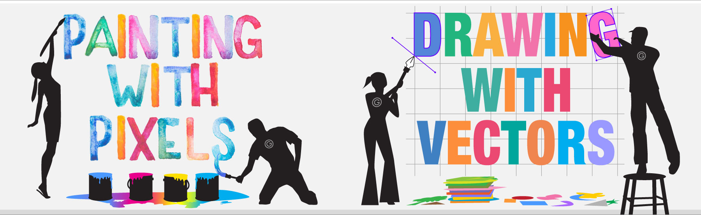
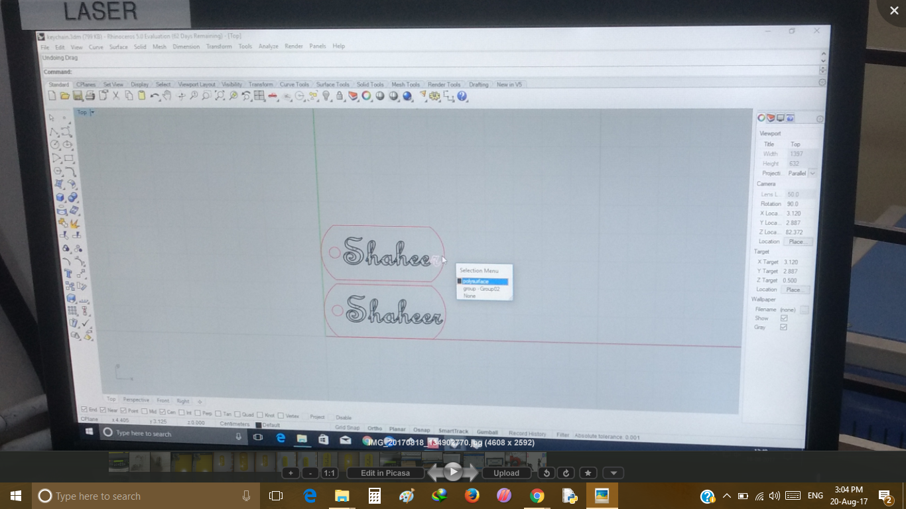
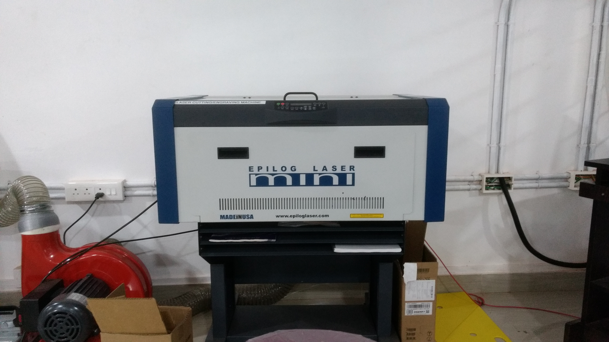
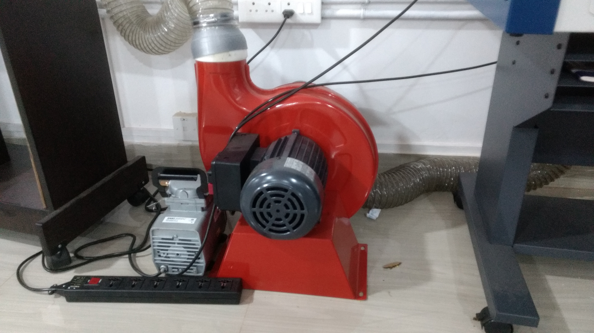
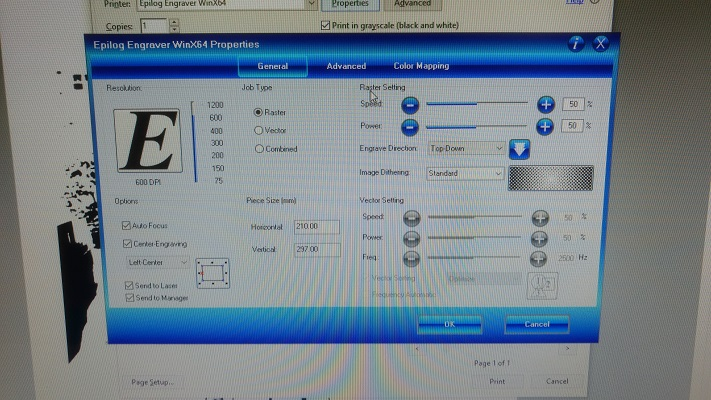
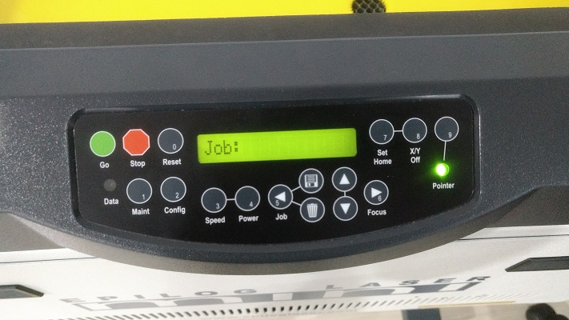

 ### Laser Cutting
 
- Laser Cutter are used for two functions

  - Cutting
  
  - Engraving
   
     Day 4 was little rush and we had a session about Vinyl cutting Machine, Laser cutter and asked us to design something useful things for each machines. I started with Laser Cutter , I was thinking about to design a keychain with my name on it , and I choose my picture to engarve that on a carboard. there are two types of functions by using a laser cutter, they are cutting and engraving. the function determined by system configuration such as power , speed and image type whether it is rastor or vector.     
 
- Picture Type
 
   - Vector  Vector Files are usually used for cutting purposes used to design 3d max,Auto cad..etc  
 
   - Rastor  Rastor Files are usually used for engraving Purposes we can use any 2D design softwares like paint software in windows
 
       
      
- Inkscape

    Inkscape is a free and open-source vector graphics editor; it can be used to create or edit vector graphics such as illustrations, diagrams, line arts, charts, logos and complex paintings. Inkscape's primary vector graphics format is Scalable Vector Graphics (SVG), however many other formats can be imported and exported.        
 
-    

  - Laser Cutter
    
    

  - Fume Extractor
  
    

  - Configuration 
  
    

  - Control Panel
   
   

   

