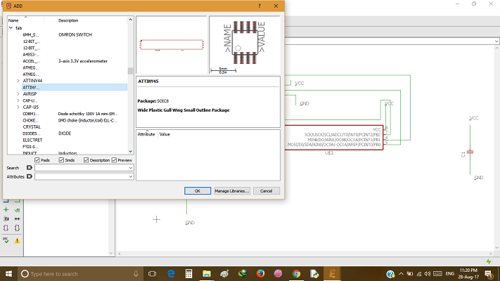
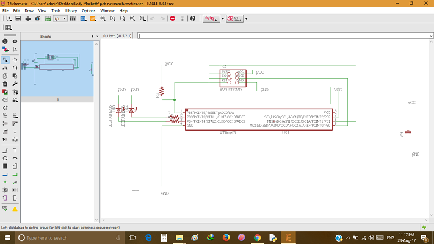
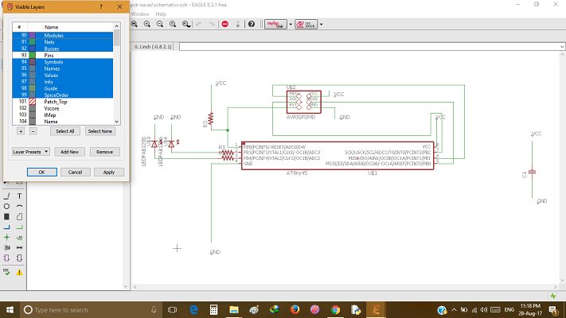
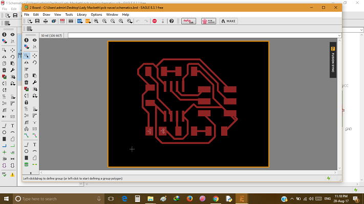
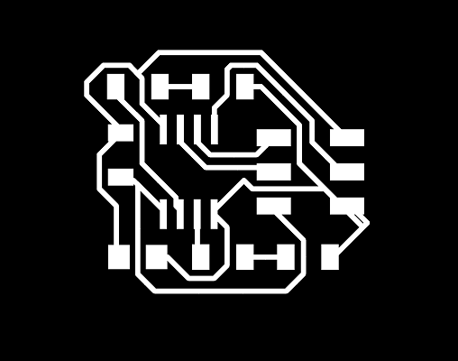

 ## Electronics Production 
   
   In electronics production we designed a simple circuit and constructed its board and schematic file to be milled from shopbot and to make a pcb. Circuit consist of two LED's controlled by a mini microcontroller and includes resistors and capacitor to make the circuit long life 
 
- Steps 
 
  - Design Circuit Using Eagle  
 
   
   
  - add required libraries like fab.lbr

  - then add components using add command
    
   
   
  - choose smd type component

  - after adding give names for components by using name command

  - then type label on command bar inorder to visible name of the component

  - then join components using wires

  - after finishing the circuit 
  
   

  - choose board from sketch/board
     
  - then make a fine adjustemnts 

  - then load and test its 100% possible

  - then choose layer option from edit view 
     
    
     
  - choose dimension for layout
   
    
  
  - save  file for trace
     
     
     
  - save  file for cut
   
     
     
  - file extension must be  in png format
  
  ### Download Files
  
  - [For Board File](https://shaheer08.github.io/pcb1.brd)
  
  - [For Schematic File](https://shaheer08.github.io/pcb1.sch)
  
  - [For Fab Library](https://shaheer08.github.io/fab.lbr)
