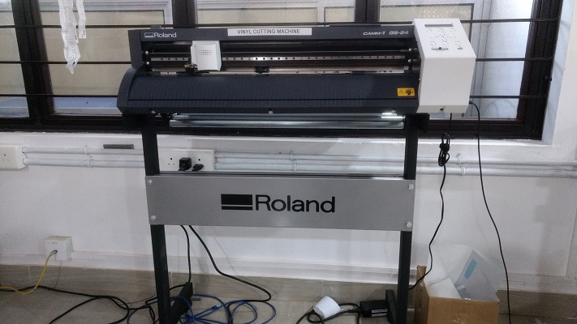
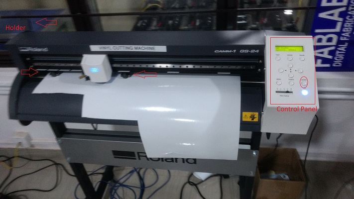
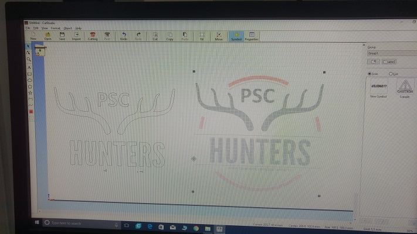
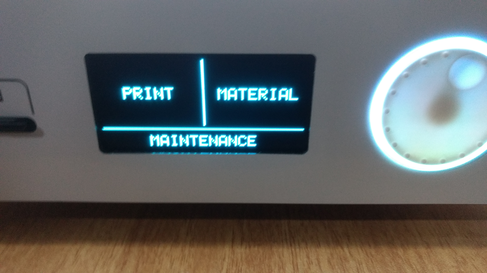

### Vinyl Cutting

  We can use Vinyl Cutting Machine to cut out a particular text or Sticker as per input given. 
   Here We are using a software called cut studio.
- Rolands Vinyl Cutter

  
  
   - It Has a Holder two limitters and one Control Panel
  
  

- Cut Studio

  Roland CutStudio software makes it easy to draw and edit circles and curves, position text on lines, and import and cut files in a wide range of formats from popular design packages. The software includes a Windows driver, Windows plug-ins for Adobe® Illustrator® and CorelDRAW®, and Mac Plug-in for Illustrator®. The result is a seamless, user-friendly operating environment
  
 - A logo opened in Cutstudio 
 
   
  
- Steps to use a vinyl Cutter

  - Open Cut studio
  
  - If its text then Enter whatever you want to cut out
  
  - Select whole text and choose properties and ensure your dimensions 
  
  - Then Go to Vinyl Cutting machine and place paper 
  
  - There could be 2 options role or sheet choose one 
  
      
  
  - Then make print request from cut studio
  
  - All done, and take it from vinyl cutter
  
  - Paste wherever you like
  
      

 
 
  
  
