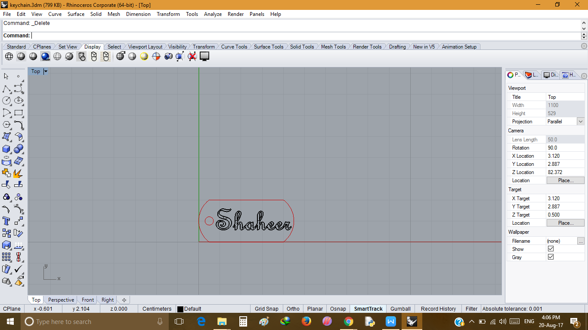
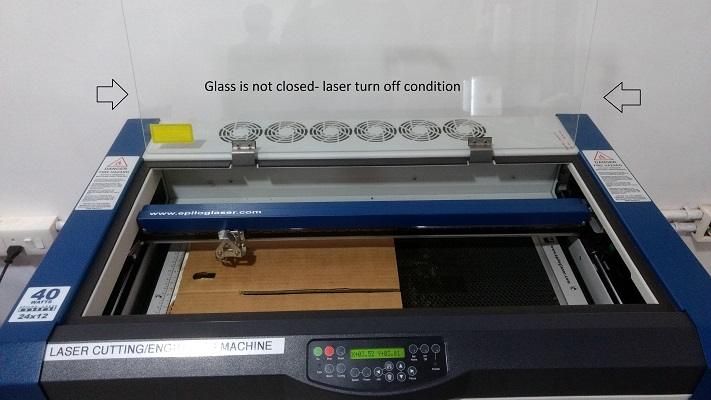
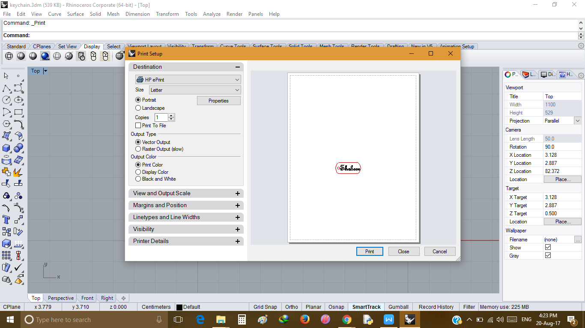
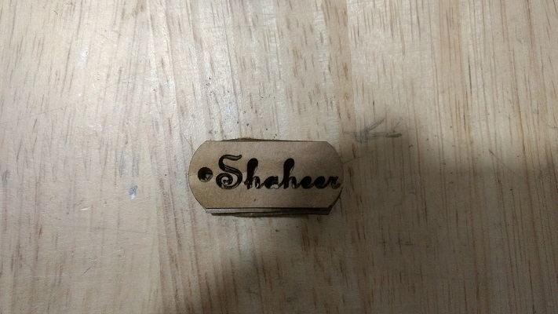
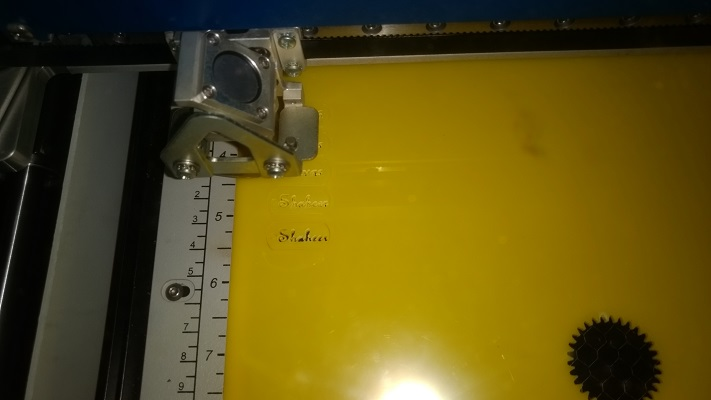
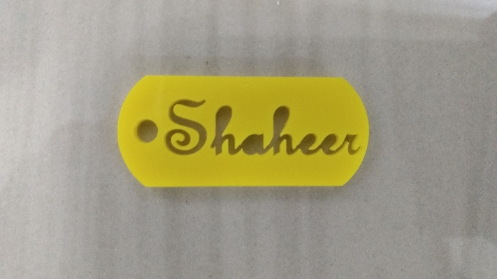

### Design Of Design

  I was planned to make a keychain, having my name printed on it. And Here i need to perfrom cutting function,
    Then I designed a file in Rhinoceros 3D to get an Vector image, and Cut out from a Plastic Sheet. 
    
- Steps
  
   - First we need to take measurements I choose 4.5 cm in length and 2 cm in width
    
   - First Make Rectangular Plane 
   
   - Make Arcs With Rectangular plane 
   
   - Enter your name by using Text tool
   
   - Save as .3dm file 
   
- Designing keychain in Rhino

  - 
  
- Test With a Carboard

  - 

- Keep Glass Open to check any error existing

  - 
  
-  Print the file

  - 
  
- Configuration Part 

   - More Power for Cutting
   - Less speed for Cutting
   
- Finally keychain obtained from carboard
  
  - 
  
- Now Using Plastic Sheet and Same Steps Repeated

  - Machine in Action

  - 
  
  - Keychain is ready
  
  - 

