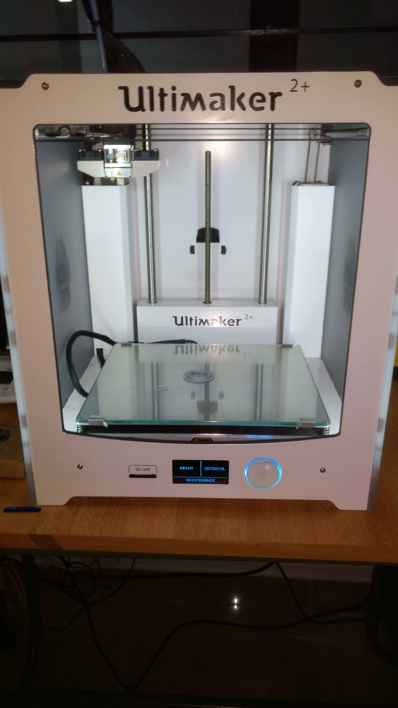
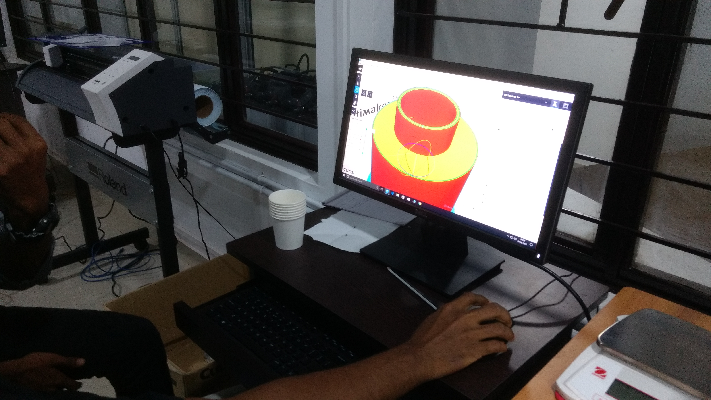

###                                         Welcome to My Fab Lab World

_It's a time to learn "How to Make Almost Anything!"_

### What is Fab lab ?
_A fab lab (fabrication laboratory) is a small-scale workshop offering (personal) digital fabrication.A fab lab is typically equipped with an array of flexible computer-controlled tools that cover several different length scales and various materials, with the aim to make "almost anything". This includes technology-enabled products generally perceived as limited to mass production._
### Do you Know Who is  Neil Gershenfeld?
_Neil A. Gershenfeld (born 1959 or 1960) is an American professor at MIT and the director of MIT's Center for Bits and Atoms, a sister lab to the MIT Media Lab. His research studies are predominantly focused in interdisciplinary studies involving physics and computer science, in such fields as quantum computing, nanotechnology, and personal fabrication.He is Considered As Father Of FAB LAB._

### What Do You mean By Code ?
_Code, a rule for converting a piece of information into another form or representation_.

## [Day 1](https://shaheer08.github.io/Day-1)

_We had a great Session About What is Fab lab and Convinced us "How to Make Almost Anything"_.

## Day 2
We got an idea about How to Document our Work Properly and had a session about Github Page creation.

### CNC
_Computer numerical control (CNC) is the automation of machine tools by means of computers executing pre-programmed sequences of machine control commands.This is in contrast to machines that are manually controlled by hand wheels or levers, or mechanically automated by cams alone_
## Ultimaker
_Ultimaker is a 3D printer manufacturer. Their product line includes the Ultimaker 3 family, Ultimaker 2 family and the Ultimaker Original. The company started out as an open-source printer company.3D printing, also known as additive manufacturing (AM), refers to processes used to create a three-dimensional object in which layers of material are formed under computer control to create an object.Objects can be of almost any shape or geometry and are produced using digital model data from a 3D model or another electronic data source such as an Additive Manufacturing File (AMF) file_

 
## Cura
_Cura prepares your model for 3D printing. For novices, it makes it easy to get great results. For experts, there are over 200 settings to adjust to your needs. As it’s open source, our community helps enrich it even more._
 
                                                               
 
## Nozzle
_Nozzles are the last physical item in your printer to touch the filament before it becomes your 3D printed part, so it’s important to understand how they work if you want to take full advantage of the possibilities afforded by the different types_
 

 
### About Me
_I am An Engineering Student Doing B.Tech in Electronics And Communication Engineering_.
### Support or Contact
**Muhammed Shaheer C**
 
email:shaheerwyd@gmail.com
 
Phone:<u>8111838406</u>
 

