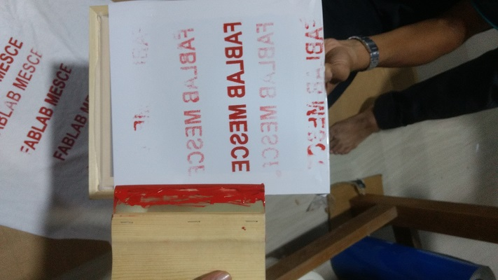
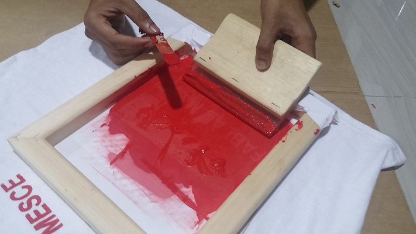
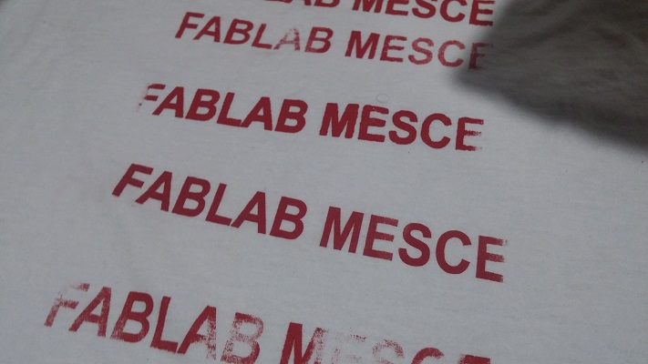

### Printing On a T-Shirt

  Here We printed the text FAB LAB MESCE on a T-shirt 
  
- Steps

   - Make a stencil contain what to be printed
  
    

   - stencil can make using vinyl cutter as already seen before

   - then paste on a squre frame

   - then place that frame where we want print

   - transfer ink to that and drag up and down
    
    
    
   - then wait until its getting Dry
   
    
