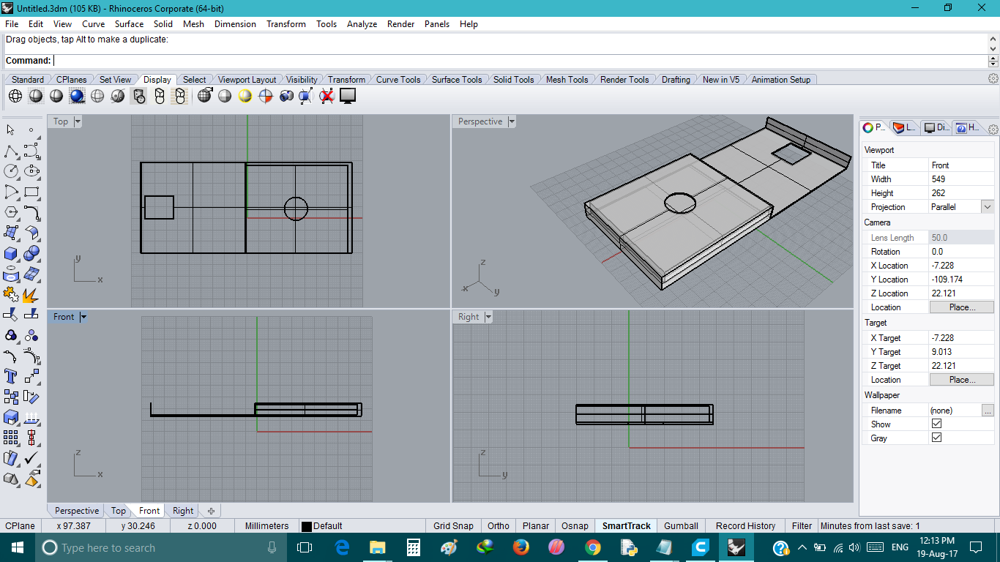
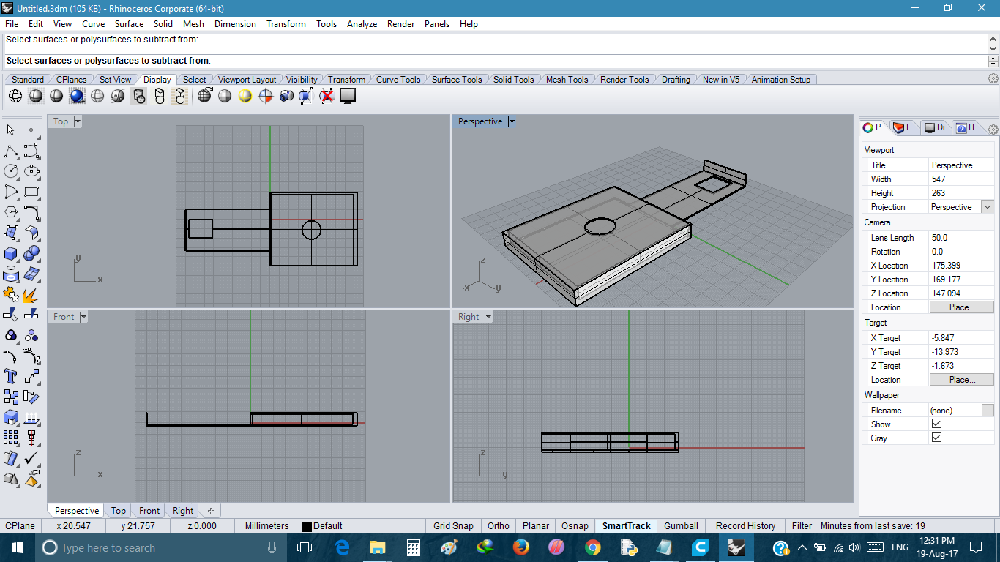
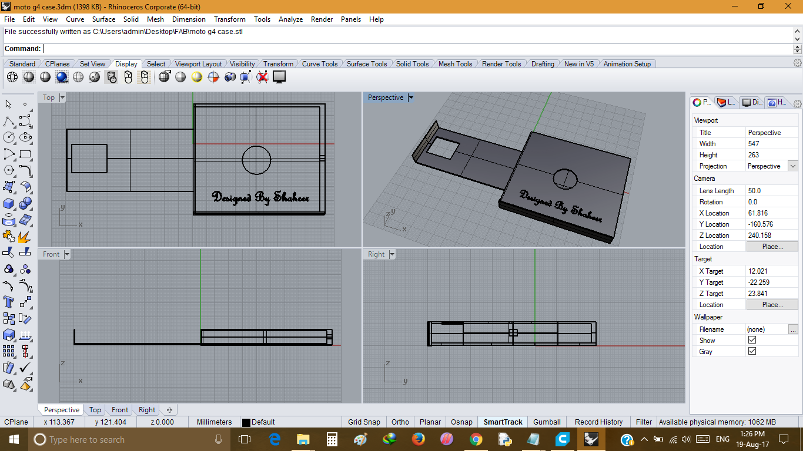
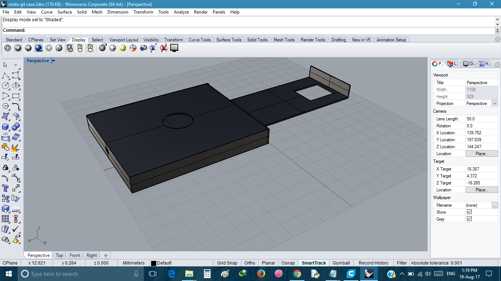
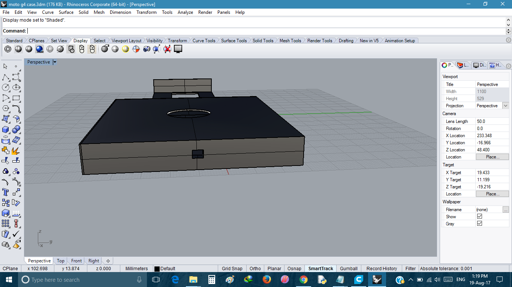
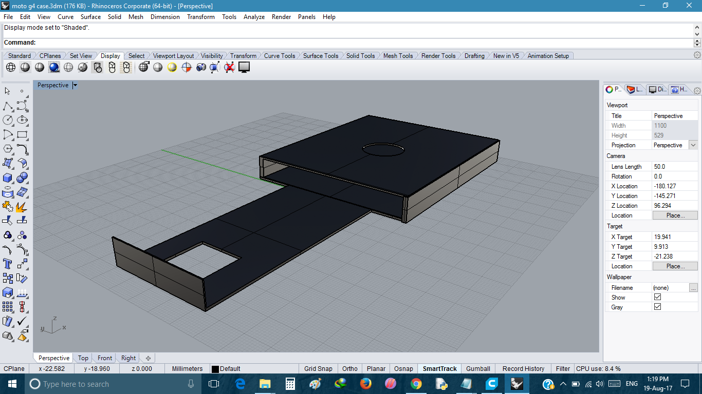
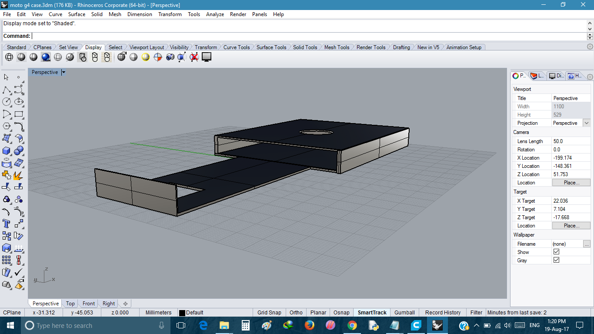
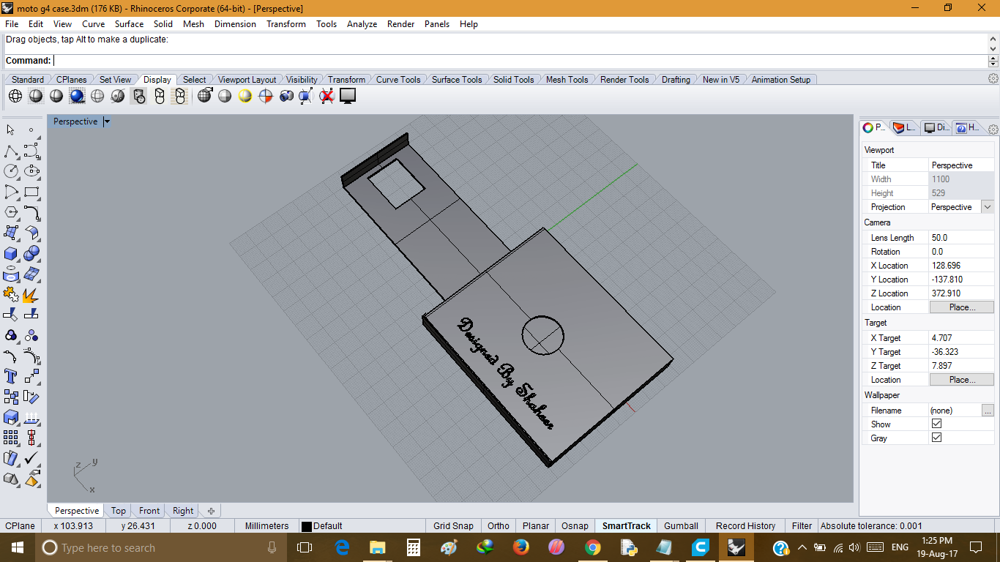
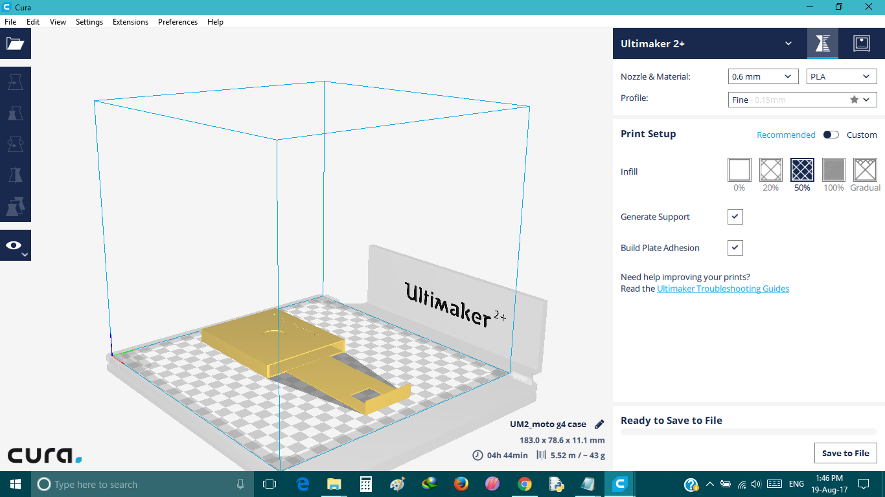
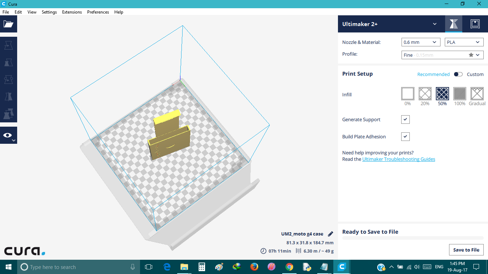

- ### Hanging Bag Case and Holder for Charging Cell Phone - Designed for Motorola G4 Plus
  - It provides a perfect place for your cellphone or power bank when you charge it
  - Prevents children from touching your cellphone 
  - Keeps mobile phones protected (off floor) in soft, rubber-like case
- #### Idea and Dimension
   I am using Moto G4, so I decided to make a hanging case for my phone, then for design i took measurements of my phone and charger
   153 x 76.6 x 9.8 mm, Then i stated with Rhino and completed my design.
   
   - Steps
      - Make a Rectangular box according to the measuremnts
      - Make another box having less size than first one
      - Using Boolean Difference tool cut off unwanted parts
      - Make a Rectangular hole charger
      - Make a Sqaure hole for charger port
      
  - Various Design Steps-1
  
  
  
  - Various Design Steps-2
  
  
  
  - Various Design Steps-3
  
  
  
  - Model at Different Angles-1
  
  
  
  - Model at Different Angles-2
  
  
  
  - Model at Different Angles-3
  
  
  
  - Model at Different Angles-4
  
  
  
  - Model at Different Angles-5
  
  
  
  - Model at Different Angles-6
  
  
  
  - File opened in Cura-1
  
  
  
  - File opened in Cura-2
  
  
  
- #### Download Files

  - [For STL](https://github.com/shaheer08/case.stl)
  
  - [For 3dm](https://github.com/shaheer08/case.3dm)
  
  
  
  
  
