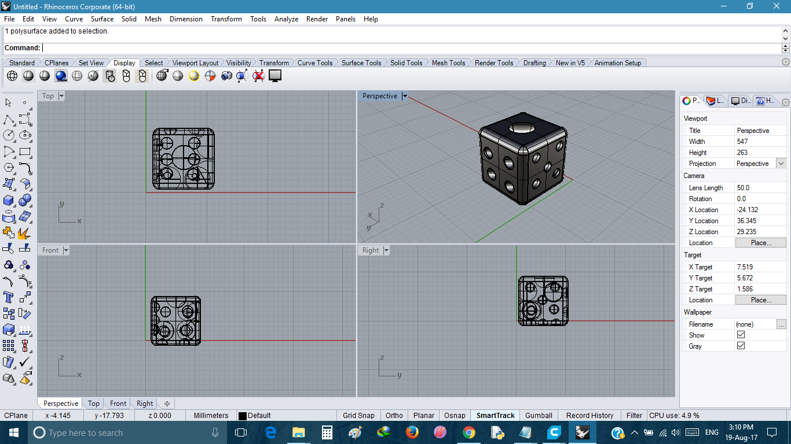
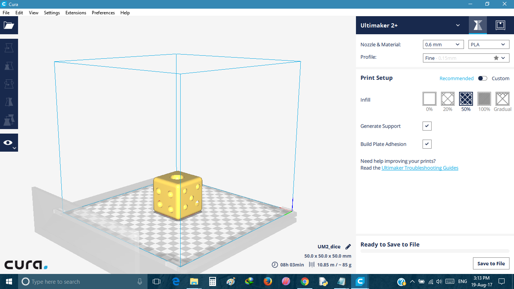

- ### Dice

  I designed a Dice using Rhinoceros 3d, I choose 1mm x 1mm x 1 mm Cube And make it
  - Steps
     - Open Rhinoceros 3D
     - Select File new choose small files in mm
     - Choose tool called Rectangle plane and  enter dimensions
     - Use command and enter extrude cv then enter height
     - Choose tool called sphere having diameter 1mm 
     - Choose Boolean difference to make our desired number on each side by subtracting sphere from cube
     
- Design and Gecode Conversion

   - Dice Designed Using Rhinoceros 3D
   
   
   - File opened in Cura
      
   
- Download Files

  - [For STL](https://shaheer08.github.io/dice.stl)
  - [For 3dm](https://shaheer08.github.io/dice.stl)

     
