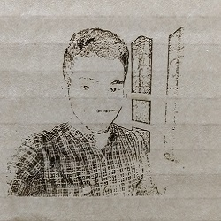

### Engraving Machine

Laser Cutter Can also Used as a engraving machine , usually use rastor pictures to engraving operation,to obtain rastor picture we use any 2D softwares like paint or picture having extension like jpg,gif,png are rastors. Here i engraved my own
picture to a carboard.
    
- Steps

  - Select a picture 
  
  - Apply Greyscale effect on that picture using inkscape or any software
  
  - make a Suitable dimension
  
  - use print option and Configure for engraving
  
- Greyscaled Picture

   
    
- Configuring for engraving

   
  
- Place Carboard On Engraving Machine

   
  
- After Print Request  Engraved Picture is ready
  
   
 
