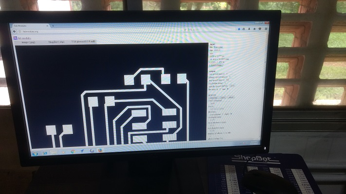
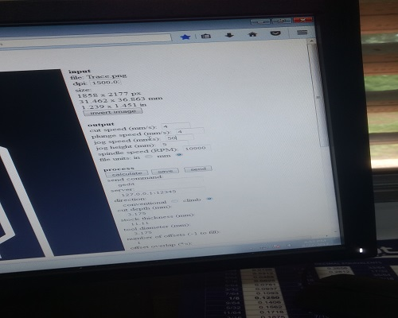
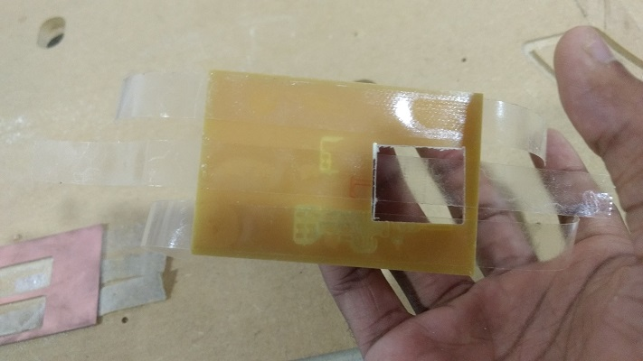
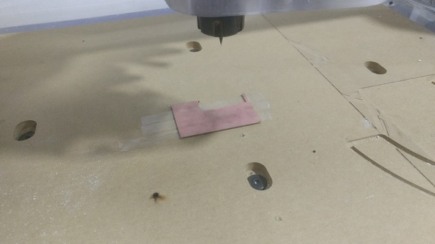
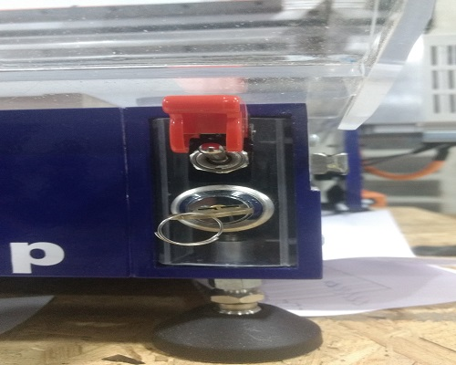
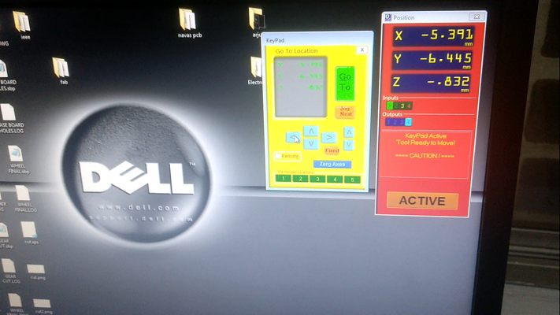
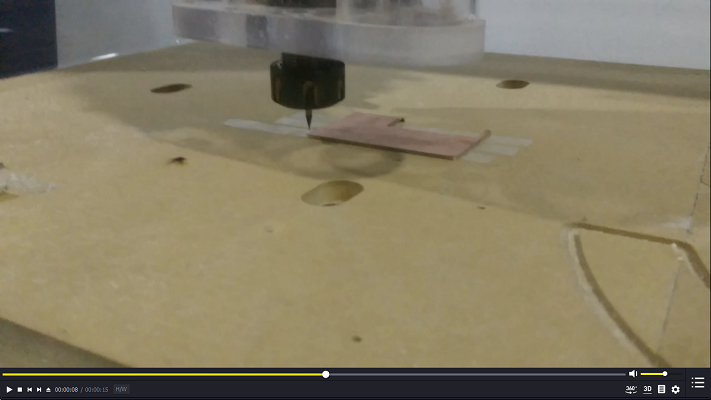
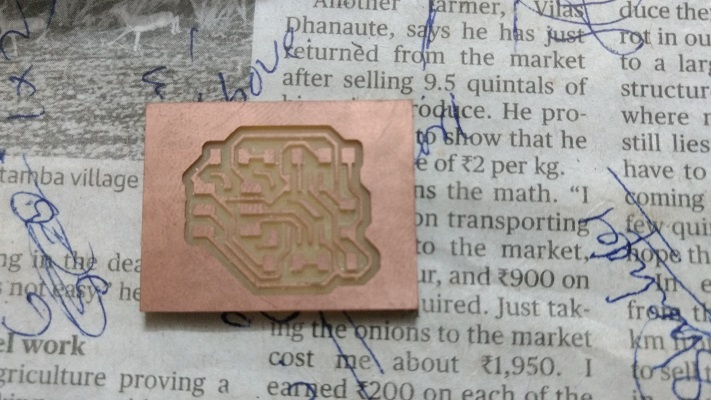

## Shop Bot

To mill designed circuit to pcb we need gecode. to obtain gecode we want to convert png file into gecode. to do that we need to visit fabmodules.org

- Steps

  - Goto Fabmodules.org
  
  - then choose png file

  - then choose shopbot
   
  - 
  
  - then choose rough cut

  - enter required values on blanked boxes
  
  - 
  
  - then save and apply

  - and generate gecode
  
  - Apply insulation tape on PCB
  
  - 
  
  - Paste PCB a fixed place
  
  - 
  
  - Turn on shopbot
  
  - 
  
  - then File open in shopbot application

  - Fix origin by adjusting its x,y,z coordinates 
  
  - 
  
  - and once you find your origin set zero for all axis

  - then choose cutter part

  - choose file and select

  - click okay then it starts to mill
  
  - 
  
  - After Milling  and cutting
  
  - 
