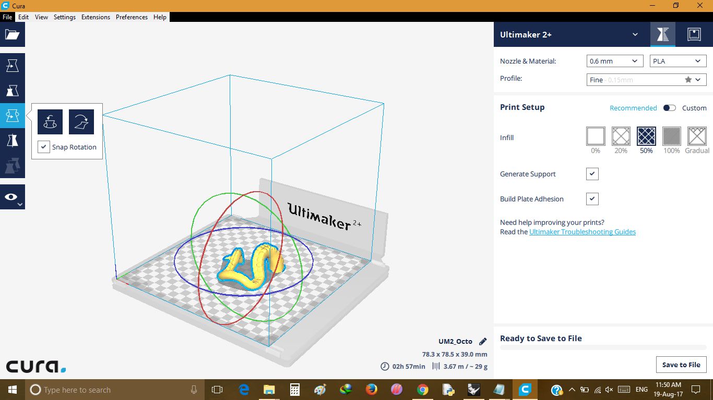
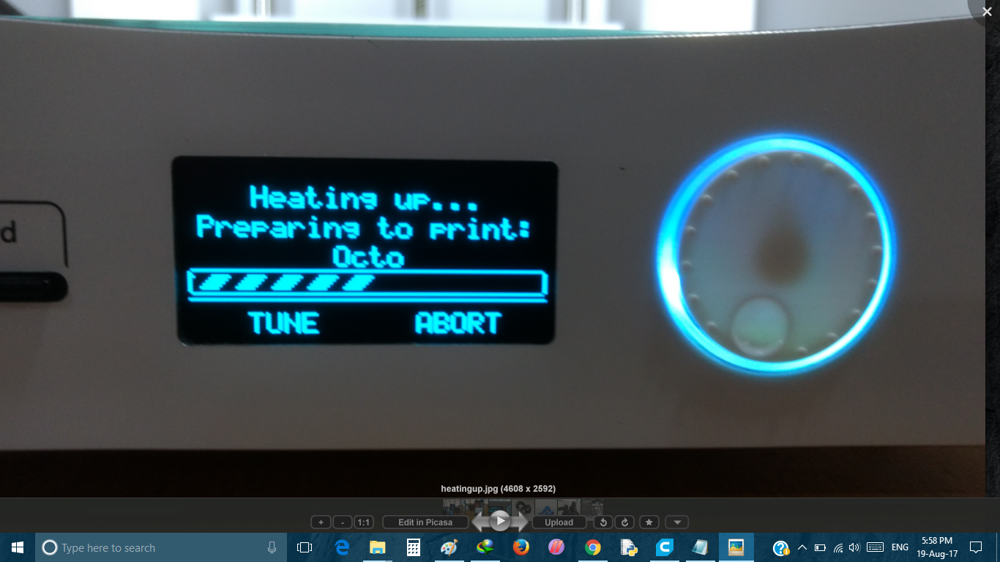
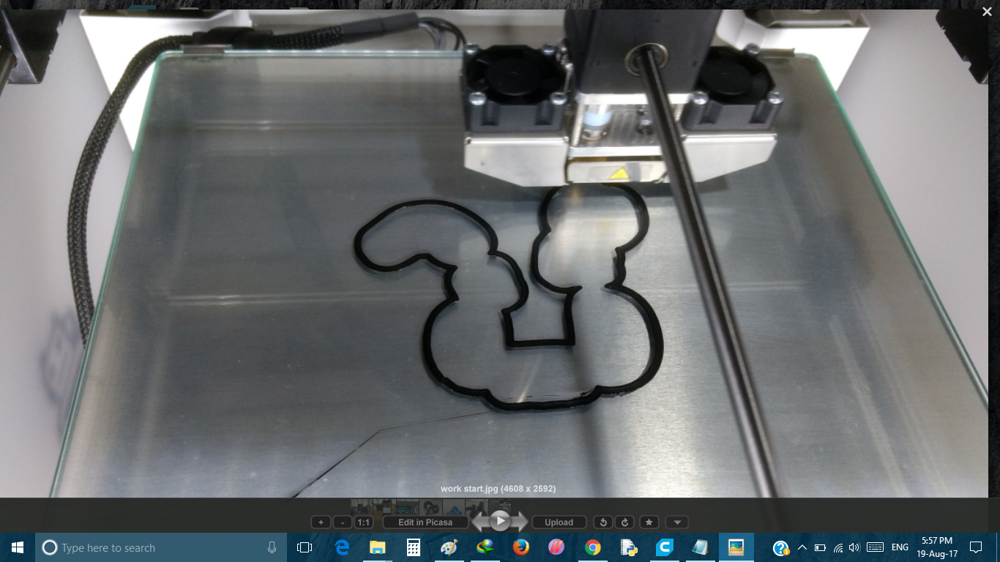
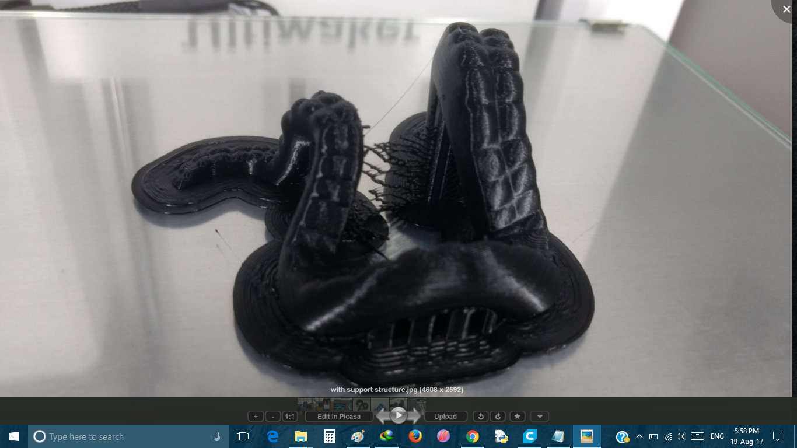
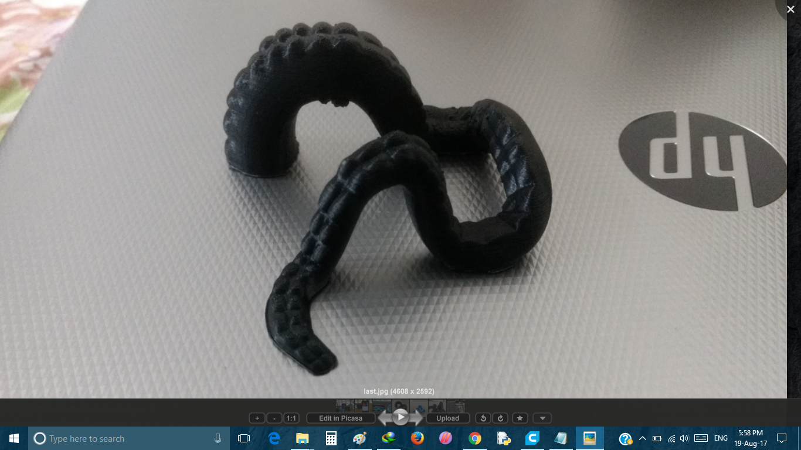
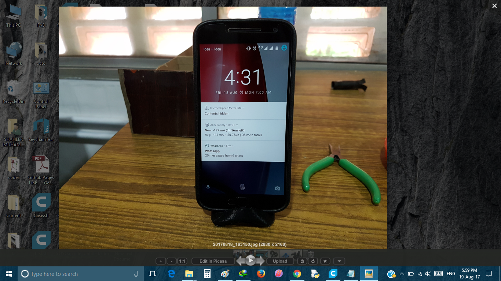
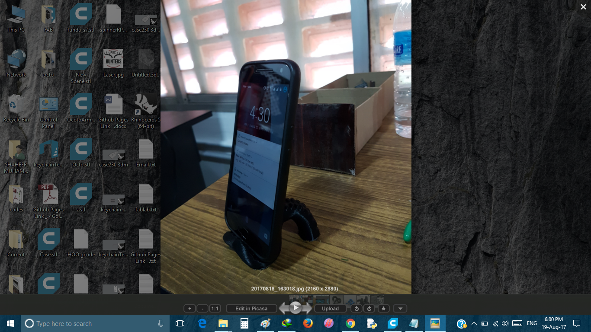

- ### Octopus Mobile Stand
   It was looking good and i got a sample model of octopus mobile stand from thingiverse.com and I printed using ultimaker.       
- Steps
  
   - STL file open in Cura 
  
   - And Check generate Support
  
   - Choose Nozzle 0.6 mm and Fill about 50 %
   
   - Make sure lay Flat option is applied 
   
   - minimise time consumption as much as possible
  
  
   - File Opened in Cura
   
   
   - File loading to Ultimaker
   
   
   - Ultimaker Starts  to printing
   
   
   - Ultimaker Completed model with Support
   
     
   - After elimination of Support Structures
   
   
   - My phone on Octopus Stand-01
   
   
   - My phone on Octopus Stand-02
   
   
- ### Download File for octopus mobile stand
 
   - [For STL file](https://www.thingiverse.com/download:977256)

