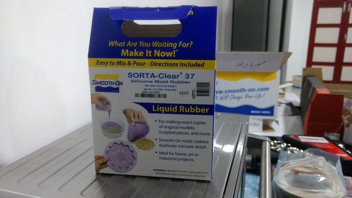
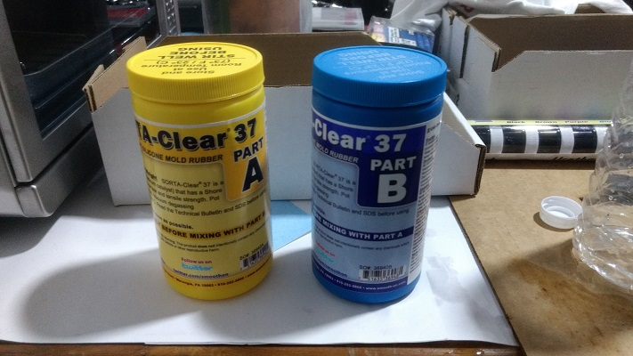
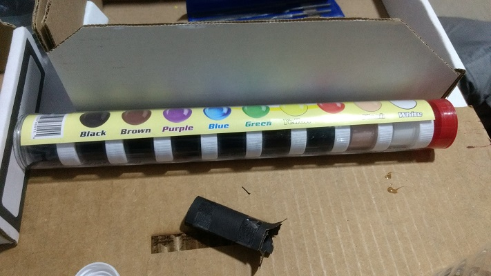
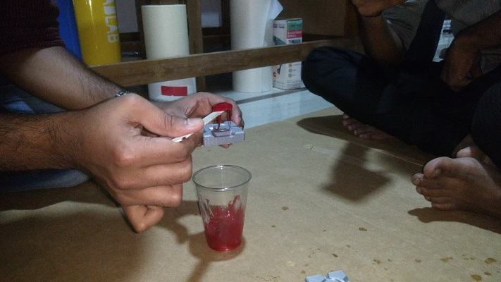
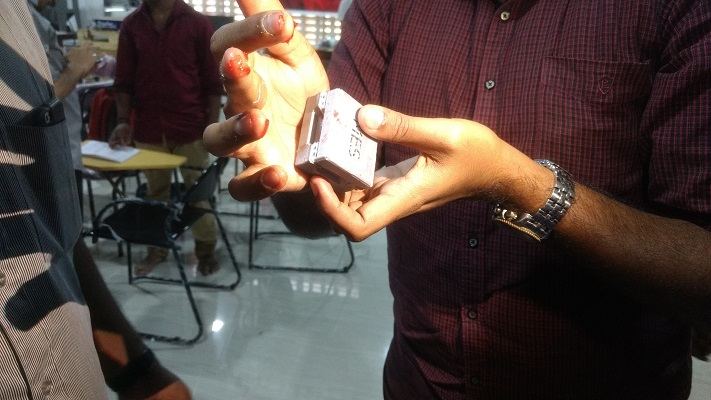
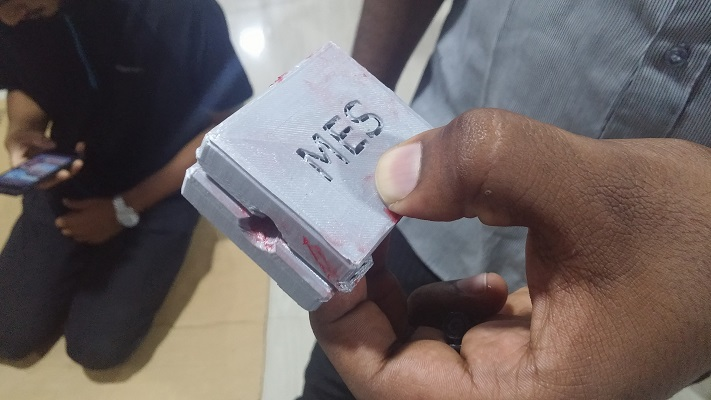

### Ring Shape

 Here we made a ring shape using Moulding
 
 - Steps

  - Make a shape to be mold usinng 3d printer or any other way

  - it must be a two part mold

  - Choose A and B substrate equal amount and mixed in a dry jar or something
  
  - 
  
  - 

  - Then add Colour whichever you like
  
  - 

  - Then Transfer mix into mold and wait until its get hard.
  
  - 
  
  - 
  
  - After filling
  
  - 

  - Remove mold and its ready
  
  - 
  
  - 
