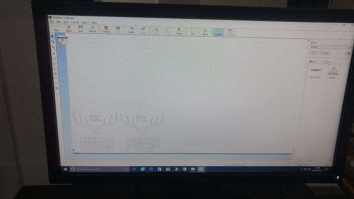

### Sticker Cutting Using Vinyl Cutter

   We can use vinyl cutter to make stickers , for that we need a design of stciker here i have a logo of my blog and I use that picture to make a sticker
    
  - Steps
  
    - Find a Picture or Design a sticker to be cut out
    
       
    
    - Open with cut studio
     
     
    
    - Select the picture in cutstudio
        
    - choose picture alignment and modify upto a decent look
    
    
    
    - Place paper on vinyl cutter
    
    
    
    - Choose sheet from role and sheet
    
    
    
    - Adjust limiters position
    
    - Make print request
    
    - its ready
    
    
