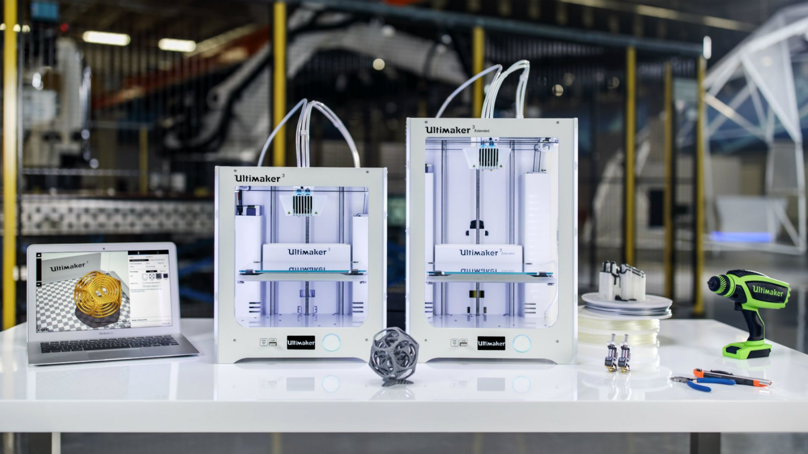

#                                         Welcome to My Fab Lab World
 

_It's a time to learn "How to Make Almost Anything!"_
_We had a great Session About What is Fab lab and Convinced us "How to Make Almost Anything"_.
_We got an idea about How to Document our Work Properly and had a session about Github Page creation._

### What is Fab lab ?
_A fab lab (fabrication laboratory) is a small-scale workshop offering (personal) digital fabrication.A fab lab is typically equipped with an array of flexible computer-controlled tools that cover several different length scales and various materials, with the aim to make "almost anything". This includes technology-enabled products generally perceived as limited to mass production._
### Do you Know Who is  Neil Gershenfeld?
_Neil A. Gershenfeld (born 1959 or 1960) is an American professor at MIT and the director of MIT's Center for Bits and Atoms, a sister lab to the MIT Media Lab. His research studies are predominantly focused in interdisciplinary studies involving physics and computer science, in such fields as quantum computing, nanotechnology, and personal fabrication.He is Considered As Father Of FAB LAB._

### What Do You mean By Code ?
_Code, a rule for converting a piece of information into another form or representation_.
## Course Progress
#### [Syllabus](https://shaheer08.github.io/Syllabus)
### Day 1

- [Indroduction To Fablab](https://shaheer08.github.io/Day-1)

### Day 2

- [Github Pages and Documentation](https://shaheer08.github.io/Day-2)

### Day 3

- [3D Printing](https://shaheer08.github.io/Day-3)

- [First 3D Model](https://shaheer08.github.io/first)

- [Hanging Bag Case and Holder for Charging Cell Phone](https://shaheer08.github.io/case)

- [Dice-Rough Work](https://shaheer08.github.io/dice)

- [Octopus Mobile Stand](https://shaheer08.github.io/octo)

### Day 4

- [Laser Cutting](https://shaheer08.github.io/Day-4)

- [Keychain Design](https://shaheer08.github.io/Keychain)

- [Engraving ](https://shaheer08.github.io/engraving)

### Day 5

- [Vinyl Cutting](https://shaheer08.github.io/Day-6)

- [Sticker Making](https://shaheer08.github.io/sticker)

- [Text Cutting](https://shaheer08.github.io/textcutting)

### Day 6

- [Indroduction to Eagle](https://shaheer08.github.io/eagle)

- [Electronics Production](https://shaheer08.github.io/Day-5)

- [PCB Milling(Shopbot)](https://shaheer08.github.io/mil)

### Day 7

- [Screen Printing](https://shaheer08.github.io/Day-7)

- [T-Shirt Printing](https://shaheer08.github.io/T)

- [Casting & Moulding](https://shaheer08.github.io/cast)

- [Ring Shape Mould](https://shaheer08.github.io/ring)

## CNC Machines
_Computer numerical control (CNC) is the automation of machine tools by means of computers executing pre-programmed sequences of machine control commands.This is in contrast to machines that are manually controlled by hand wheels or levers, or mechanically automated by cams alone_
 
- [Ultimaker](https://shaheer08.github.io/ultimaker)
- [Milling Machine](https://shaheer08.github.io/shopbot)
- [Laser Cutter](https://shaheer08.github.io/laser)
- [Vinyl Cutter](https://shaheer08.github.io/vinyl)

### About Me
_I am An Engineering Student Doing B.Tech in Electronics And Communication Engineering_.
### Follow Me
             

### Support or Contact
**Muhammed Shaheer C**

 shaheerwyd@gmail.com

 +91 8111838406

