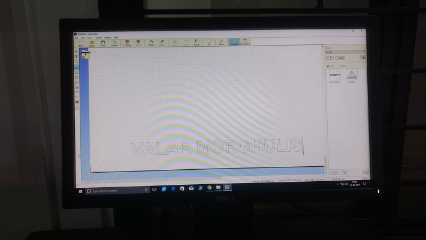
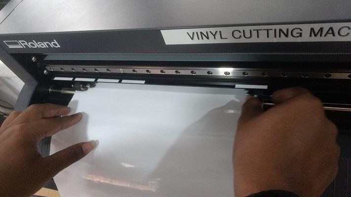
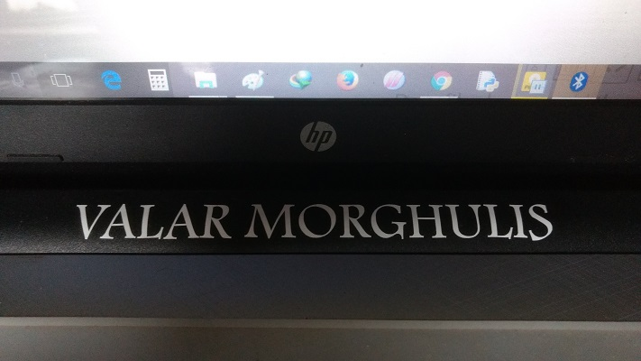

### Text Cutting Using Vinyl Cutter

 Vinyl Cutter can be used to Text cutting, For text cutting we don't need any software but cut studio. Whatever we want to cut out just type it there using text tool and make print request.
 
 
 - Steps
    
    - Open Cut Studio
 
    - Choose Text tool from left side the menu bar
      
    - Typer Whatever we want here i type  'VALAR MORGHULIS'
    
      
        
    - choose Height and width of the letter from properties
    
    - Place paper on vinyl cutter
    
      
    
     - Choose sheet from role and sheet
    
       
    
    - Adjust limiters position
    
    - Make print request
    
    - its ready I pasted on my laptop
    
    
