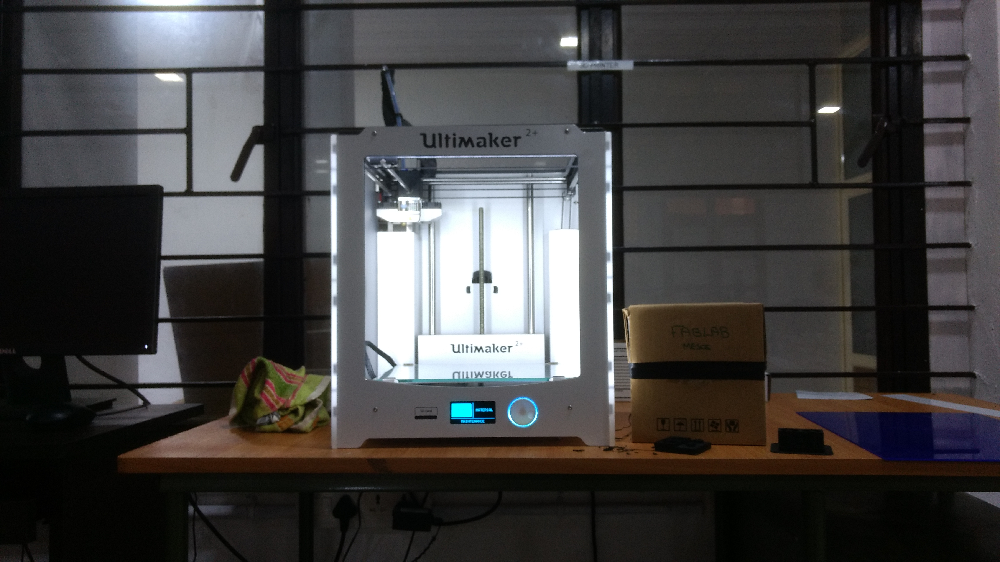

- ### Ultimaker
Ultimaker is a 3D printer manufacturer. Their product line includes the Ultimaker 3 family, Ultimaker 2 family and the Ultimaker Original. The company started out as an open-source printer company.3D printing, also known as additive manufacturing (AM), refers to processes used to create a three-dimensional object in which layers of material are formed under computer control to create an object.Objects can be of almost any shape or geometry and are produced using digital model data from a 3D model or another electronic data source such as an Additive Manufacturing File (AMF) file.
  - Ultimaker
  
    
- #### Materials
  - PLA (polylactic acid)
  - ABS (acrylonitrile butadiene styrene)
  - CPE (co-polyester)
  - PC (polycarbonate)
 
When you select a print material, it is important to consider the characteristics of the object you want to print and the environment in which it will be used. Ideally, you will select your print material based on material characteristics such as:

  - Technical properties
  - Aesthetic qualities
  - Processing ability
[For more about material selection,Click here](https://ultimaker.com/en/resources/50296-which-material-should-i-use)
- #### Cura

Cura prepares your model for 3D printing. For novices, it makes it easy to get great results. For experts, there are over 200 settings to adjust to your needs. As it’s open source, our community helps enrich it even more.[Starting Cura first time, Click here to know more](https://ultimaker.com/en/resources/20407-first-use-cura-2)

   - File opened in Cura

                                                                    

- #### Nozzle
Nozzles are the last physical item in your printer to touch the filament before it becomes your 3D printed part, so it’s important to understand how they work if you want to take full advantage of the possibilities afforded by the different types.
  - 0.25 mm
  - 0.4 mm
  - 0.6 mm 
  - 0.8 mm 

  - Nozzle Pack

