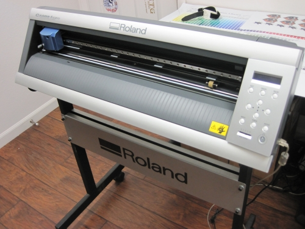

### Vinyl Cutter

A vinyl cutter (or vinyl plotter) is a computer-controlled plotting device with a blade instead of a pen. A vector based design is created in a software program (usually Adobe Illustrator or Corel Draw) and then sent to the cutter where it cuts along the vector paths laid out in the design. The cutter is capable of moving the blade on an X and Y axis over the material, cutting it into any shape imaginable. Since the vinyl material comes in long rolls, projects with significant length like banners or billboards can be easily cut as well. The one major limitation with vinyl cutters is that they can only cut shapes from solid colors of vinyl. A design with multiple colors must have each color cut separately and then layered on top of each other as it is applied to the substrate. Also, since the shapes are cut out of solid colors, photographs and gradients cannot be reproduced with a standalone cutter.

 
